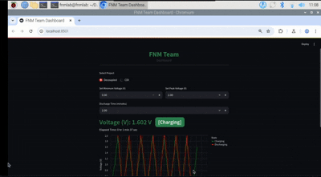
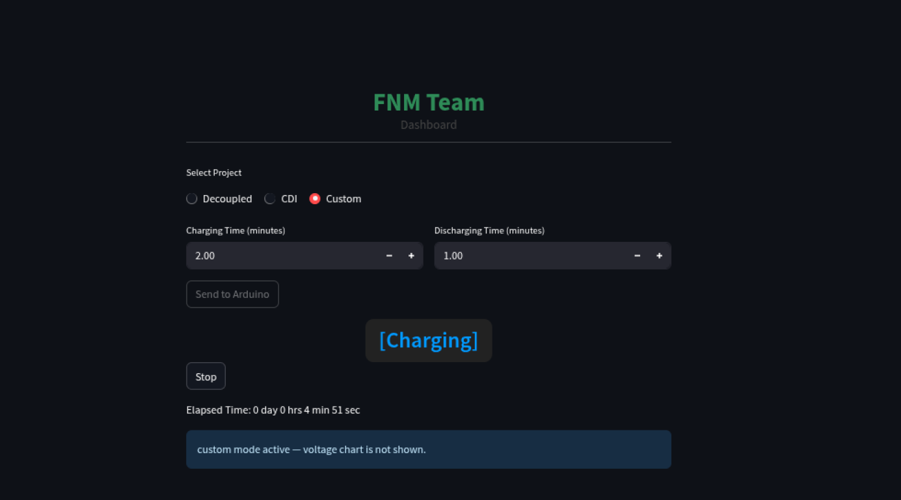

# FNM-Automated
A real-time dashboard for controlling and monitoring a Decoupled and CDI experiment.
Built with Streamlit and Arduino, the app enables users to set minimum and peak voltage parameters, start/stop the process, and visualize real-time voltage data as well as operational states (charging/discharging).
All data is logged and can be downloaded for further analysis.

## Sonakul kamnuanchai , Varawut Kornsiriluk

## Features:

- Set minimum and peak voltage via user interface

- Real-time communication and control with Arduino via USB serial

- Displays current voltage and system state (charging/discharging)

- Live-updating voltage graph

- Download experiment data as CSV

## Typical Use Case:
Designed for laboratory setups or research on Decoupled and CDI project, enabling easy monitoring, control, and data collection via web dashboard.

## HOW TO RUN THIS APP :
- Connect Raspberrypi with username : fnmlab , password : fnm@123 and Open timinal
- source ./fnm_env/bin/activate
- cd Desktop/FNM-Automated/Raspi-streamlit/
- streamlit run combine_app.py

### Kill process streamlit
- pkill -f streamlit

## Sample Interface :
### Decoupled Project

### CDI Project

### Custom Time
