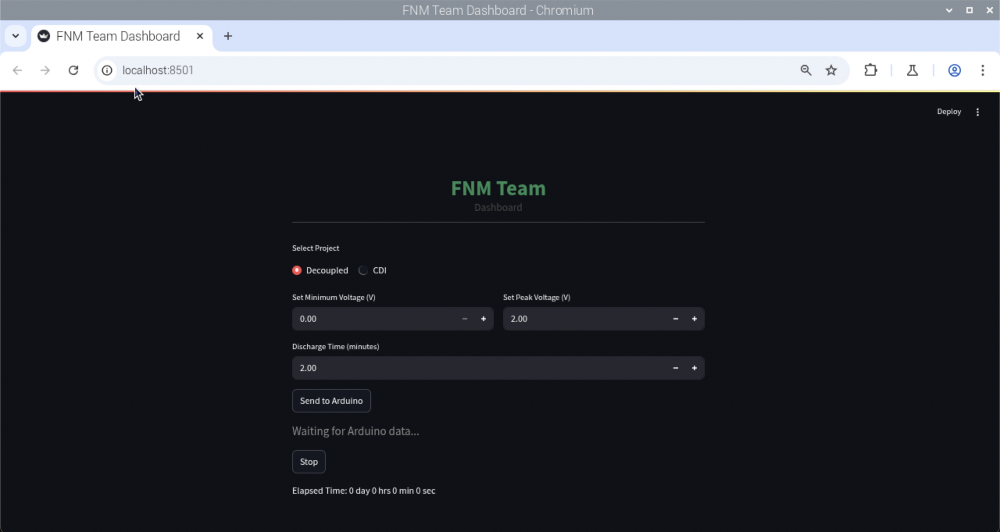
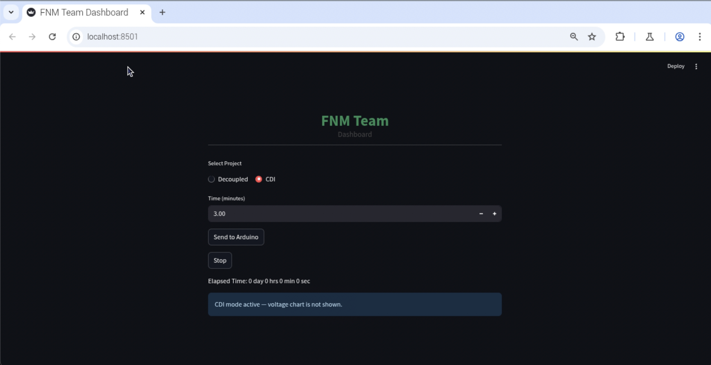

# FNM-Automated
A real-time dashboard for controlling and monitoring a Decoupled and CDI experiment.
Built with Streamlit and Arduino, the app enables users to set minimum and peak voltage parameters, start/stop the process, and visualize real-time voltage data as well as operational states (charging/discharging).
All data is logged and can be downloaded for further analysis.

## Features:

- Set minimum and peak voltage via user interface

- Start/stop the electrolyzer and reset experiment with a single click

- Real-time communication and control with Arduino via USB serial

- Displays current voltage and system state (charging/discharging)

- Live-updating voltage graph

- Download experiment data as CSV

## Typical Use Case:
Designed for laboratory setups or research on Decoupled and CDI project, enabling easy monitoring, control, and data collection via web dashboard.

## HOW TO RUN THIS APP :
- Connect raspi with username : fnmlab , password : fnm@123
- pip install -r requirements.txt
- streamlit run ./Raspi-streamlit/combine_app.py

## Sample Interface :
### Decoupled Project

### CDI Project

